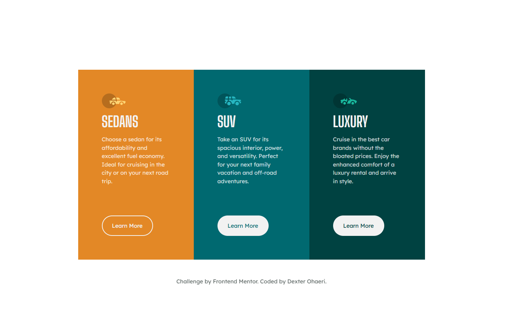

# Frontend Mentor - 3-column preview card component solution

This is a solution to the [3-column preview card component challenge on Frontend Mentor](https://www.frontendmentor.io/challenges/3column-preview-card-component-pH92eAR2-). Frontend Mentor challenges help you improve your coding skills by building realistic projects. 

## Table of contents

- [Overview](#overview)
  - [The challenge](#the-challenge)
  - [Screenshot](#screenshot)
  - [Links](#links)
- [My process](#my-process)
  - [Built with](#built-with)
  - [What I learned](#what-i-learned)
  - [Continued development](#continued-development)
  - [Useful resources](#useful-resources)
- [Author](#author)
- [Acknowledgments](#acknowledgments)

## Overview

### The challenge

Users should be able to:

- View the optimal layout depending on their device's screen size
- See hover states for interactive elements

### Screenshot

  

### Links

- Solution URL: [Solution URL](https://github.com/MrDexterO/3-column-preview-card-component-solution)
- Live Site URL: [Site URL](https://mrdextero.github.io/3-column-preview-card-component-solution/)

## My process

### Built with

- Semantic HTML5 markup
- CSS3
- CSS custom properties
- Flexbox

### What I learned

Everything went well. I just consolidated on what I learned from the previus challenge on flexbox.

### Continued development

I will keep working to improve my understanding and application of responsive designs.

## Author

- Frontend Mentor - [@MrDexterO](https://www.frontendmentor.io/profile/MrDexterO)
- GitHub - [@MrDexterO](https://github.com/MrDexterO)

## Acknowledgments

I acknowledge Frontend mentor for this opportunity.
